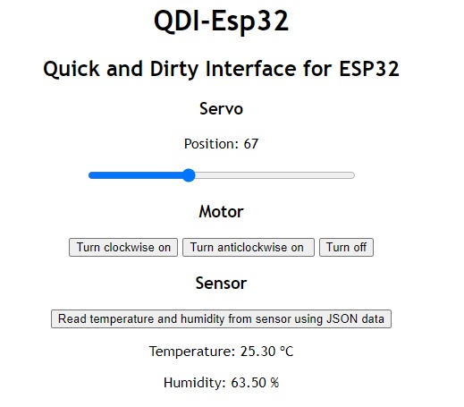

# qdi-esp32 – Quick and Dirty Interface for ESP32 Prototypes

**qdi-esp32** – *Quick and Dirty Interface for ESP32* – because sometimes you just need to get things working without overengineering. This project is a barebones template that lets your ESP32 serve up a simple web UI with minimal fuss.

Perfect for rapid prototyping, hardware hacking, or impressing your friends with a Wi-Fi-enabled LED toggle. No dependency hell – just raw HTML, a pinch of JavaScript, and your ESP32 doing what it does best.

---

## ✨ Features

- **Built-in Web Interface**: Serves static HTML, CSS, and JS directly from the ESP32 using SPIFFS.
- **No External Dependencies**: Pure browser-native code – because simple is sexy.
- **Wi-Fi Access Point Mode**: Your ESP32 becomes its own hotspot. No router? No problem.
- **Quick and Dirty by Design**: Get it running fast, tweak as you go, and clean it up later (or not).

---

## 🚀 Getting Started

1. **Install Tools**:
   - [Visual Studio Code](https://code.visualstudio.com/)
   - [PlatformIO IDE extension](https://platformio.org/install)

2. **Clone the Repository**:
    
    ````bash
    git clone https://github.com/lucianovk/qdi-esp32.git
    ````

3. **Open the Project in VSCode**

4. **Select Your Board** in PlatformIO under `PIO Home → Projects & Configuration`.

5. **Upload the Web Files and Firmware**:
   - Build File System Image
   - Upload File System Image
   - Build firmware
   - Upload firmware

6. **Connect to the ESP32 Wi-Fi**:
   - SSID: `qdi-esp32`
   - Password: `12345678`

7. **Access the Web Interface**:
   - Open your browser and go to [http://192.168.4.1](http://192.168.4.1)

---

## 🖼️ UI Preview

Below is a screenshot of the web interface served by the ESP32:



---

## 📁 Project Structure

- `src/`: Main ESP32 application code
- `data/`: Static website (HTML, CSS, JS) to be served from SPIFFS
- `platformio.ini`: PlatformIO build configuration
- `qdi-screenshot.png`: UI preview image

---

## 📜 License

This project is released under the [Creative Commons Zero v1.0 Universal license (CC0-1.0)](LICENSE), placing it in the public domain.
